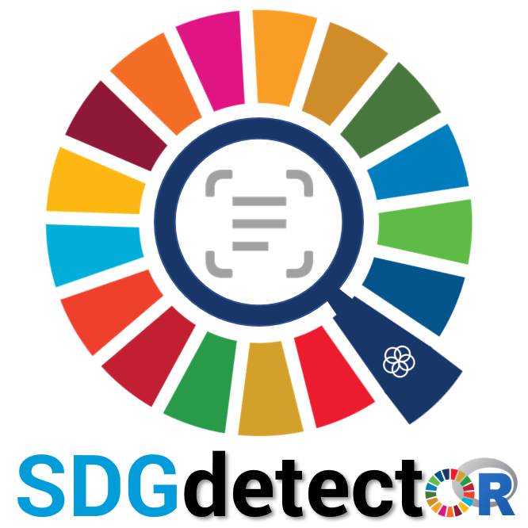
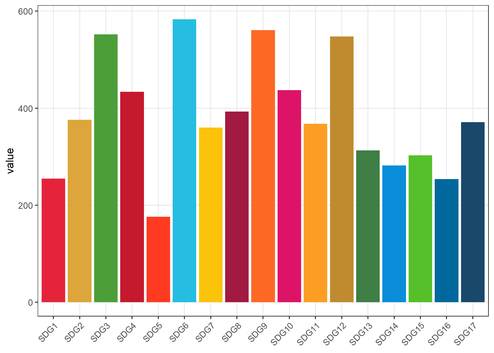
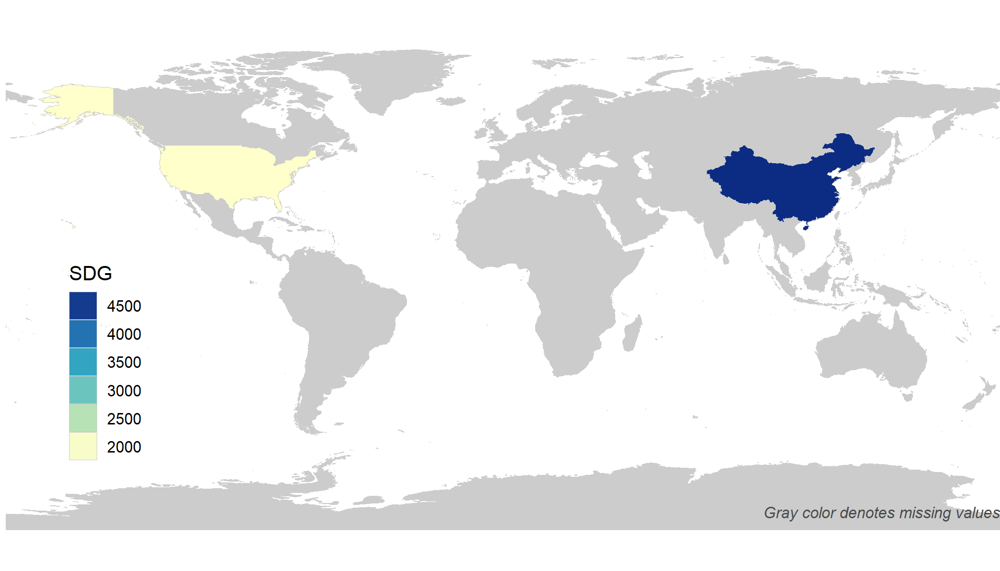
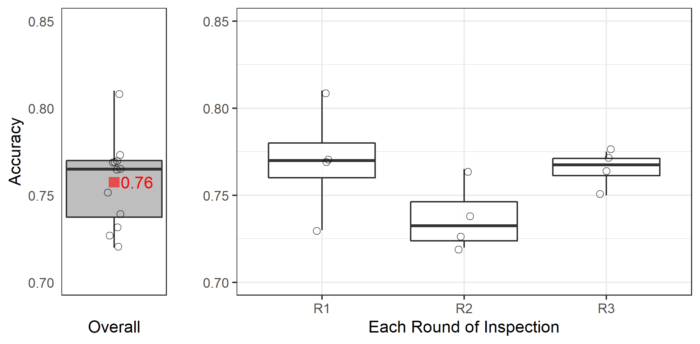

[](https://CRAN.R-project.org/package=SDGdetector)
[](https://zenodo.org/badge/latestdoi/431620191)
[](https://www.gnu.org/licenses/gpl-3.0)
[](https://cranlogs.r-pkg.org/badges/grand-total/SDGdetector)
[](https://cranlogs.r-pkg.org/badges/SDGdetector)

[](https://doi.org/10.21105/joss.05124)

<p align="center">
  
</p>

# SDG Detector

In 2015, leaders worldwide adopted 17 Sustainable Development Goals (SDGs) with 169 targets to be achieved by 2030 (https://sdgs.un.org). The framework of SDGs serves as a blueprint for shared prosperity for both people and the earth. `SDGdetector` identifies both direct and indirect expressions of SDGs and associated targets in chunks of text. It takes a data frame with a specified column of text to process as inputs, and outputs a data frame with original columns plus matched SDGs and targets.

## Installation

There are two ways to install the **SDGdetector** R package.

### 1. CRAN

**SDGdetector** is now available on
[CRAN](https://CRAN.R-project.org/package=SDGdetector), so you can install it with:

``` r
install.packages("SDGdetector")
```

### 2. GitHub

You can alternatively install the development version of **SDGdetector** from [GitHub](https://github.com/Yingjie4Science/SDGdetector) as follows:

``` r
if (!require("remotes")) {
  install.packages("remotes")
}

remotes::install_github("Yingjie4Science/SDGdetector")
```    
    
## Example Usage

**To detect SDGs from text**
``` r
library(SDGdetector)

### string as input data
text <- 'our goal is to mitigate climate change, end poverty, and reduce inequality globally'
SDGdetector(x = text)

### dataframe as input data
df <- data.frame(col = c(
  'our goal is to end poverty globally', 
  'this product contributes to slowing down climate change'))
SDGdetector(x = df, col = col)
```

**To detect regions/countries in text**
``` r
x = 'China and USA devoted the largest efforts on solar energy'
detect_region(x)
```

**To use specific SDG colors**
``` r
sdg_color(1)
sdg_color(x = 1:17)
```


**To use specific SDG icons**
``` r
sdg_icon(x = 7, res = 300)
```


**To visualize SDG on a bar plot**
``` r
data("sdgstat")
df <- sdgstat

# plot SDG on a bar plot
plot_sdg_bar(data = df, sdg = SDG, value = Value)
```
<p align="left">
  
</p>

**To visualize SDG on a map**
```r
# plot SDG by country on a map
plot_sdg_map(data = df, sdg = SDG, value = Value, country = Country, by_sdg = F)
```
<p align="left">
  
</p>

## Accuracy Evaluation

This package has achieved high accuracy in detecting SDG-related statements within textual data (> 75%, measured by the alignment between the R package results and four experts' manually-coded results; see this [supplementary document](https://drive.google.com/file/d/1EHUV6Jc3N4A-IshKU4dbxtIqlfj50mzi/view?usp=share_link) for more information. The data and code for reproducing the performance metrics can be found in this repo under [`./docs/accuracy_evaluation/`](https://github.com/Yingjie4Science/SDGdetector/tree/main/docs/accuracy_evaluation). 

<p align="left">
  
</p>
The overall accuracy (left) and the accuracy for each round of inspection (right). The red squared dot in the left plot indicates the mean value and the hollow round dots represent the accuracy values reported by each expert.


## License

The SDGdetector **R** package is distributed under the [GNU General Public License v3.0](https://www.gnu.org/licenses/gpl-3.0.en.html).


## How to Cite

Get citation information for *SDGdetector* in R doing
    `citation(package = 'SDGdetector')`
    
```
To cite SDGdetector in publications, please use:

  Li et al. (2023). SDGdetector: an R-based text mining tool for quantifying efforts toward Sustainable Development Goals. Journal of Open Source Software 8, 5124.
  https://doi.org/10.21105/joss.05124.

A BibTeX entry for LaTeX users is

  @Article{,
    title = {SDGdetector: an R-based text mining tool for quantifying efforts toward Sustainable Development Goals},
    author = {Yingjie Li and Veronica F. Frans and Yongze Song and Meng Cai and Yuqian Zhang and Jianguo Liu},
    journal = {Journal of Open Source Software},
    doi = {10.21105/joss.05124},
    year = {2023},
    volume = {8},
    number = {84},
    pages = {5124},
    url = {https://github.com/Yingjie4Science/SDGdetector},
  }
```


## Reporting Bugs

*SDGdetector* is distributed as is and without warranty of suitability for application. If you encounter flaws with the software (i.e. bugs) please report the issue. Providing a detailed description of the conditions under which the bug occurred will help to identify the bug. *Use the [Issues tracker](https://github.com/Yingjie4Science/SDGdetector/issues) on GitHub to report issues with the software and to request feature enhancements.* 

