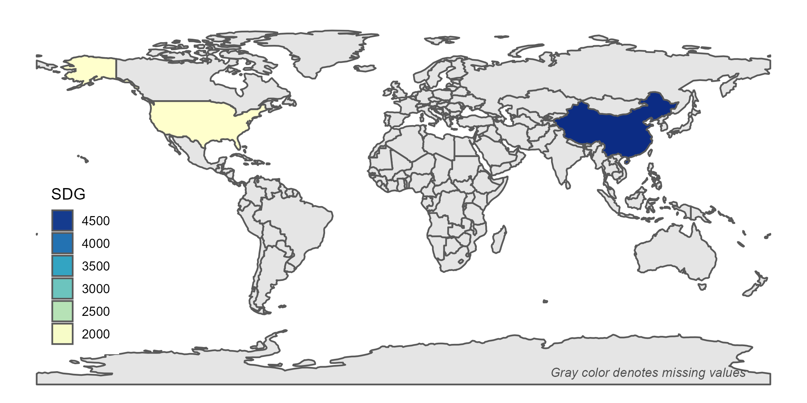

[](https://zenodo.org/badge/latestdoi/431620191)

<p align="center">
  
</p>

# SDG Detector

In 2015, leaders worldwide adopted 17 Sustainable Development Goals (SDGs) with 169 targets to be achieved by 2030 (https://sdgs.un.org). The framework of SDGs serves as a blueprint for shared prosperity for both people and the earth. `SDGdetector` identifies both direct and indirect expressions of SDGs and associated targets in chunks of text. It takes a data frame with a specified column of text to process as inputs, and outputs a data frame with original columns plus matched SDGs and targets.

## Installation

You can install `SDGdetector` from GitHub as follows:

``` r
if (!require("remotes")) {
  install.packages("remotes")
}

remotes::install_github("Yingjie4Science/SDGdetector")
```    
    
## Example Usage

**To detect SDGs from text**
``` r
library(SDGdetector)

### string as input data
text <- 'our goal is to mitigate climate change, end poverty, and reducing inequality globally'
SDGdetector(x = text)

### dataframe as input data
df <- data.frame(text=c(
  'our goal is to end poverty globally', 
  'this product contributes to slowing down climate change'))
SDGdetector(x = df, col = text)
```

**To detect regions/countries in text**
``` r
x = 'China and USA devoted the largest efforts on solar energy'
detect_region(x)
```

**To use specific SDG colors**
``` r
sdg_color(1)
sdg_color(x = 1:17)
```


**To use specific SDG icons**
``` r
sdg_icon(x = 7, res = 300)
```

<<<<<<< HEAD
**To visualize SDGs**
=======
**To visualize SDG on a bar plot**
>>>>>>> 8bd3484920db2b0db586f0a5257da6ed7612bb1f
``` r
df <- readr::read_csv('https://raw.githubusercontent.com/Yingjie4Science/SDGdetector/main/data/data_example.csv')

# plot SDG in a bar plot
plot_sdg_bar(data = df, value = value)
```
<p align="left">
  
</p>

```r
# plot SDG by country on a map
plot_sdg_map(data = df, value = value, by_sdg = F)
```
<p align="left">
  
</p>

## Accuracy Evaluation

This package has achieved high accuracy in detecting SDG-related statements within textual data (> 75%, measured by the alignment between the R package results and four experts' manually-coded results; see this [supplementary document](https://docs.google.com/document/d/1mEjlyu17JZUIphL4VeVrGr4txKBu5jJObzRtJO7G6dg/edit?usp=sharing) for more information.

<p align="left">
  
</p>
The overall accuracy (left) and the accuracy for each round of inspection (right). The red squared dot in the left plot indicates the mean value and the hollow round dots represent the accuracy values reported by each expert.


## License

The SDGdetector **R** package is distributed under the [GNU General Public License v3.0](https://www.gnu.org/licenses/gpl-3.0.en.html).


## How to Cite

Get citation information for *SDGdetector* in R doing
    `citation(package = 'SDGdetector')`
    
```
To cite SDGdetector in publications, please use:

  Li et al. (2022). SDGdetector: an R-based text mining tool for quantifying the efforts toward SDGs. Journal of Open Source Software, 0(0), 3 PAGE.
  https://doi.org/10.xxxxxx/draft.

A BibTeX entry for LaTeX users is

  @Article{,
    title = {SDGdetector: an R-based text mining tool for quantifying the efforts toward SDGs},
    author = {Yingjie Li and Meng Cai and Veronica F. Frans and Yuqian Zhang and Jianguo Liu},
    journal = {Journal of Open Source Software},
    year = {2022},
    volume = {1},
    number = {1},
    pages = {3},
    url = {https://github.com/Yingjie4Science/SDGdetector},
  }
```


## Reporting Bugs

*SDGdetector* is distributed as is and without warranty of suitability for application. If you encounter flaws with the software (i.e. bugs) please report the issue. Providing a detailed description of the conditions under which the bug occurred will help to identify the bug. *Use the [Issues tracker](https://github.com/Yingjie4Science/SDGdetector/issues) on GitHub to report issues with the software and to request feature enhancements.* 

