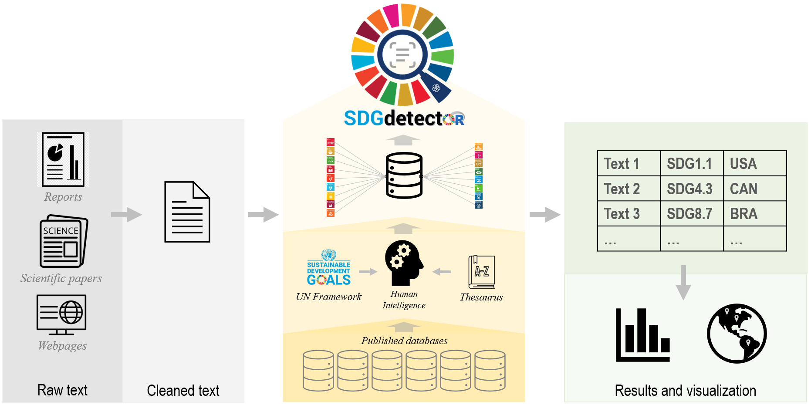

# Summary

The global interest in moving towards a sustainable future has grown exponentially at all levels. The United Nations’ Sustainable Development Goals (SDGs), adopted by world leaders in 2015, provided an integrated framework to track progress toward sustainability [@un_global_2019]. Textual data, such as public statements posted on websites, organization reports, and scientific publications, can be a rich source for evaluating the planned and ongoing efforts, as well as achievements towards sustainability. However, no computational tool exists to date that can accurately and efficiently identify SDG-related statements from these large amounts of text data. To fill this gap, we developed the ***SDGdetector*** package in R [@r_core_team_r_2021] to map textual data to specific goals and targets under the UN SDG framework for quantitative analysis. This is the first open-source, high-resolution, and high-accuracy analytical package that can identify which and how many SDG goals and targets are declared in any type of text-based data frame or corpus. This package thus enables a unique way to monitor individuals' and organizations' commitments and efforts towards advancing the 17 SDGs and 169 associated targets. 

# Statement of need

The Sustainable Development Goals (SDGs) agenda, adopted by all United Nations Member States in 2015, provides a shared blueprint for nations, cities, corporations, research institutions, and individuals to track and plan their contributions to social, economic, and environmental transformations [@un_global_2019]. Although considerable efforts and contributions have been made to use existing statistical data for SDG assessments, half of the 231 indicators listed in the global indicator framework for SDGs lack either established methodologies or available data for measuring and implementing the goals ([https://unstats.un.org/sdgs/iaeg-sdgs/tier-classification](https://unstats.un.org/sdgs/iaeg-sdgs/tier-classification)). As a complement to the commonly used statistical data, textual data (e.g., websites, organization or government reports, and scientific publications) are rarely considered but show great potential for becoming a rich and important data source to narrow this existing data gap. For example, by identifying SDG commitments and contributions in text from legally-binding corporate annual reports, one can evaluate which SDGs are being mentioned (directly or indirectly) and to what extent corporations are moving towards them. Or, published research papers could also be evaluated to link research institutions’ commitments to SDG progress. Manually reviewing and matching text corpora to specific SDGs or targets can be extremely time-consuming and costly. In addition, though conventional manual coding may achieve high accuracy, it faces precision issues because of intercoder reliability challenges. This is especially an issue when attempting to objectively classify and map massive data into tens and hundreds of topic categories (e.g., the 169 SDG targets). To address these challenges, we developed the ***SDGdetector*** package, which automates the text analysis process via a text mining approach (Figure 1).



**Figure 1.** Flowchart for identifying SDG-related statements from textual data.

The SDGdetector package was developed by (1) compiling six existing databases on SDG search queries [@un_global_2019; @duran-silva_controlled_2019; @jayabalasingham_identifying_2019; @vanderfeesten_search_2020; @schubert_scientific_2020; @bautista-puig_unveiling_2019; @wulff_text2sdg_2021]; (2) reviewing all SDG targets and indicators [@un_global_2019] to manually refine and update the search terms to create query dictionaries at the levels of the 17 SDGs and the 169 SDG targets (which correspond to the 231 SDG indicators); (3) manually assessing and improving the accuracy of these queries using thousands of randomly-selected statements from real-world corporate annual reports across multiple iterations; and (4) turning these queries into a lexical database for text mining across large bodies of text and tabulating the matched SDGs and SDG targets.

SDGdetector is a unique tool because it is by far the only one available that is equipped with a database for detecting SDG-relevant statements at the target level. In combination with this database, the text mining approach, an artificial intelligence (AI) technology, enables us to use natural language processing to transform the unstructured text within documents into normalized and structured data suitable for analysis and visualization. After repeated validation and calibration, this package has achieved high accuracy in detecting SDG-related statements within textual data (> 75.5%, measured by the alignment between the R package results and four experts’ manually-coded results; see the "Accuracy Evaluation" section on [GitHub](https://github.com/Yingjie4Science/SDGdetector) for more information).

This lightweight package has great potential to be useful in many disciplines with objectives to identify which SDGs and to what extent an entity is putting effort into them. This package can be used in large-scale research projects in the field of corporate sustainability and urban science. It can also be used in systematic reviews and syntheses of published literature and patents. The associated lexical database embedded within this R package can be also used for developing similar applications in Python or other programming languages. 

# Functionality

***SDGdetector*** is an R [@r_core_team_r_2021] package that provides functions for three main tasks: 

(1) detecting whether a reported action aligns with any specific Goals (among the 17 SDGs) and Targets (among the 169 targets) under the Global indicator framework for Sustainable Development Goals [@un_global_2019].

(2) estimating the priorities of sustainability contributions by counting how frequently a particular Goal or Target is mentioned in the text report. 

(3) detecting which countries or regions are mentioned along with the SDG statements. For global studies, this function provides a means to show where the SDG efforts could be possibly implemented or have been planned.

The package is based on the tidyverse [@wickham_welcome_2019] framework and is available on GitHub [https://github.com/Yingjie4Science/SDGdetector](https://github.com/Yingjie4Science/SDGdetector).

# Usage

(1) Data preparation. Textual data can come from a variety of sources, such as PDF files, HTML webpages, TXT, or Microsoft Word documents. The unit of text can be a clause, a sentence, or a paragraph. For the best accuracy, we suggest users split a large chunk of text into sentence or clause levels for analysis. Users can use our function *pdf2text()* or self-defined functions to extract textual data from PDF files, clean the text, split the text into sentences, and format the data in a dataframe. 

(2) Detect SDG goals and targets. The input can be a single sentence, or a dataframe that contains many rows of sentences. If the input is a dataframe, users should designate which column to be used for SDG detection. 

```r
# load package 
library(SDGdetector) 

# a string as the input
text <- 'our goal is to mitigate climate change, end poverty, and reduce 
  inequality globally'
SDGdetector(x = text)

# a dataframe as the input
df <- data.frame(text = c(
  'our goal is to end poverty globally', 
  'this product contributes to slowing down climate change'))
SDGdetector(x = df, col = text)
```

In addition to the lexical database included in the ***SDGdetector*** package, users can also add customized search queries to the lexical database. 

```r
# A list of terms used to determine whether a sentence relates to SDG efforts
terms_new <- c("improve", "farmer", "income")

# Use *AND* operator to combine the terms and generate a customized search query 
# (or called a matching pattern); 
# then add the query to the existing lexical database
add_sdg_pattern(sdg_id = 'SDG1_2', x = terms_new, operator = 'AND')
```

(3) Detect countries or regions. To understand where the SDG efforts are implemented or planned, users can use the function *detect_region()*. The result will return a list of country names in the ISO 3166-1 alpha-3 – three-letter country codes format.

```r
text = 'China and USA devoted the largest efforts on solar energy'
detect_region(x = text)
```

(4) Results and visualization. Users can summarize the detected SDG goals and targets by report (or organization), by Goal, and by region. The package provides methods for visualizing the SDG frequency, via its family of *plot_sdg_** functions. For instance, 

```r
df <- readr::read_csv('https://raw.githubusercontent.com/Yingjie4Science/
  SDGdetector/main/data/data_example.csv')

# plot SDG in a bar plot
plot_sdg_bar(data = df, value = value)
```


```r
# plot SDG by country on a map
plot_sdg_map(data = df, value = value, by_sdg = F)
```


# Acknowledgements

The authors acknowledge contributions from UN Global Sustainability Index Institute (UNGSII) Foundation during the genesis of this project. We thank Racheline Maltese for her input in developing the SDG search terms during the early stages of this project. This work was funded by the National Science Foundation (grant numbers: DEB-1924111, OAC-2118329). VFF was supported by the National Science Foundation Graduate Research Fellowship Program (Fellow ID: 2018253044).

# References
